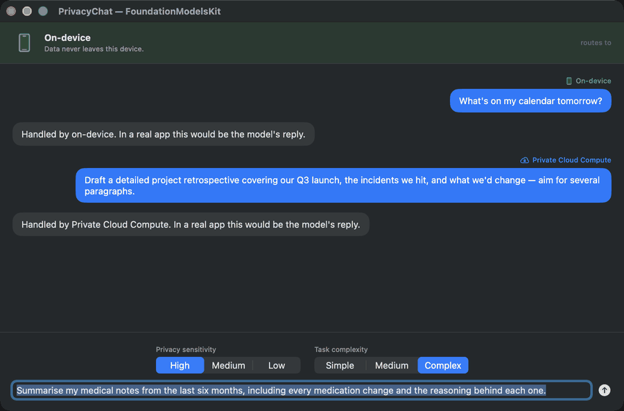
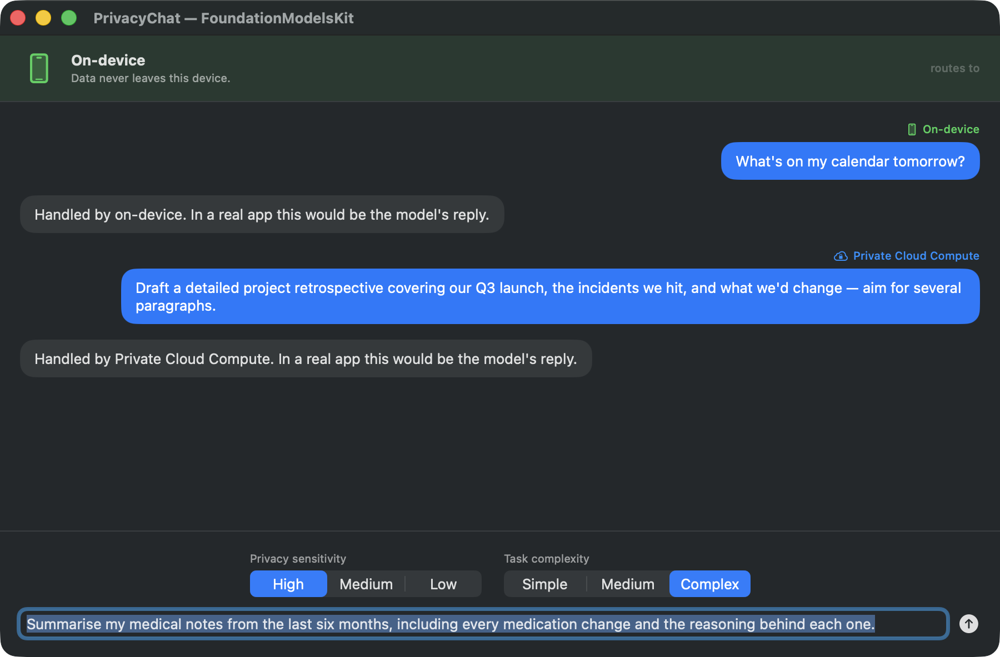
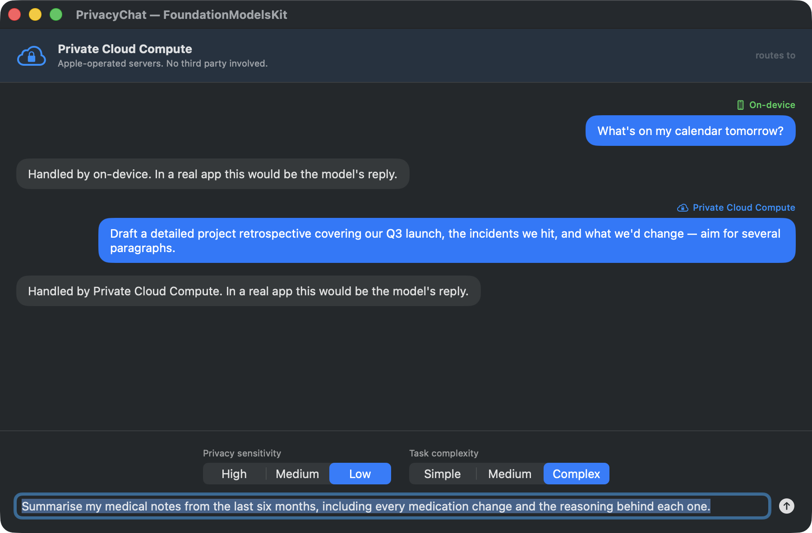

# FoundationModelsKit

**Apple gave us three tiers of language model inference and no policy layer. This is one.**

[](https://github.com/divyaravitech/FoundationModelsKit/actions/workflows/ci.yml)
[](https://swift.org)
[](Package.swift)
[](LICENSE)



*The same message, three privacy levels. Only the control changes — the routing follows.*

---

## The problem

Your app can run a prompt on-device, on Apple's Private Cloud Compute, or on a third-party API. Each is a different privacy bargain:

| | Where the data goes | Good for |
|---|---|---|
| **On-device** | Nowhere. Stays on the Neural Engine. | Short, simple tasks |
| **PCC** | Apple's servers, never third-party | Complex tasks, Apple-trusted data |
| **Third-party** | An external company's servers | Anything, highest capability |

So every app ends up writing the same logic: *is this prompt sensitive enough that it must stay local? is it too big for the on-device model? what do I do when PCC isn't reachable?* That logic gets scattered across call sites, and the privacy rule — the part that actually matters — becomes an `if` statement someone can forget.

## The fix

Declare how sensitive the request is. The router decides where it's allowed to run.

```swift
let response = try await router.sendMessage(
    request: ModelRequest(
        content: "Summarise my medical notes.",
        privacySensitivity: .high,    // never leaves the device. no exceptions.
        taskComplexity: .simple
    )
)
```

`.high` stays on-device regardless of size, complexity, or which backends are configured. There is no setting that overrides it — that's the whole point of the library.

| `privacySensitivity` | Routing |
|---|---|
| `.high` | On-device **only** — never escalates, even if the task is too big for it |
| `.medium` | On-device or PCC — never a third party |
| `.low` | Full chain: on-device → PCC → third-party |

---

## See it work


A SwiftUI app where the banner updates live as you move the privacy control — watch a long message escalate to the cloud at `.low`, then refuse to leave the device at `.high`:

```bash
git clone https://github.com/divyaravitech/FoundationModelsKit.git
cd FoundationModelsKit/Examples/PrivacyChat && swift run PrivacyChat
```

| `.high` — stays local | `.low` — escalates |
|---|---|
|  |  |

Identical message and complexity in both. Only the privacy control differs.

Or the CLI walkthrough of all six features:

```bash
cd FoundationModelsKit/Examples/ChatDemo && swift run ChatDemo
```

```
1. Same prompt, three privacy levels
────────────────────────────────────
  high    → 🔒 on-device
  medium  → ☁️  private cloud compute
  low     → ☁️  private cloud compute

  Note: .high stayed on-device despite being large and complex.

4. Automatic retry
──────────────────
  attempt 1 failed
  attempt 2 failed
  attempt 3 succeeded

5. Conversation compaction
──────────────────────────
  entries before: 12
  entries after:  6 (oldest turns summarised, 5 most recent kept)
```

No API key or Apple Intelligence hardware needed — [see the demo source](Examples/ChatDemo/Sources/ChatDemo/main.swift).

---

## Install

```swift
dependencies: [
    .package(url: "https://github.com/divyaravitech/FoundationModelsKit.git", from: "1.0.0")
]
```

Or in Xcode: **File → Add Package Dependencies…**

## Quick start

```swift
import FoundationModelsKit

let router = ModelRouter(
    onDevice: OnDeviceLanguageModel(),
    thirdParty: AnthropicLanguageModel(
        config: AnthropicConfiguration(
            apiKey: ProcessInfo.processInfo.environment["ANTHROPIC_API_KEY"]!
        )
    )
)

let response = try await router.sendMessage(
    request: ModelRequest(content: "Write a haiku about Swift.", privacySensitivity: .low)
)
print(response.content)
```

**Streaming** — works on every backend, including those without native streaming:

```swift
for try await chunk in router.streamMessage(request: request) {
    print(chunk, terminator: "")
}
```

**Retries** — exponential backoff on transient failures:

```swift
let robust = RetryingLanguageModel(wrapped: router, policy: .default)
```

**Conversation with automatic compaction:**

```swift
let store = ConversationStore()
await store.addEntry(ConversationEntry(role: "user", content: "Hello"))

if await store.shouldCompact(maxTokens: 4096) {
    try await store.compact(using: router, maxTokens: 4096)
}

try await store.save(to: sessionURL)   // survives app restarts
```

**Quality gates on every response:**

```swift
let suite = EvaluationSuite(metrics: [
    NonEmptyMetric(),
    LengthMetric(min: 20, max: 2000),
    ContainsKeywordsMetric(keywords: ["summary"]),
])

let result = await suite.evaluate(response: response, responseID: "turn-1")
if !result.overallPassed { /* retry, log, or fall back */ }
```

**Or all of it behind one facade** — routing, compaction, evaluation, and diagnostics in a single call:

```swift
let sdk = SDKIntegration(
    config: FoundationModelsKitConfiguration(
        profile: .balanced,
        evaluationMetrics: ["NonEmpty", "Length"]
    ),
    router: router,
    store: ConversationStore(),
    evaluation: EvaluationSuite(metrics: [NonEmptyMetric(), LengthMetric()]),
    regional: RegionalAvailability()
)

let (response, evaluation) = try await sdk.sendMessage(request)

try await sdk.saveTranscript(to: sessionURL)
print(await sdk.diagnostics())
```

---

## Backends

**`OnDeviceLanguageModel`** — Apple Intelligence via the `FoundationModels` framework. Requires macOS 26 / iOS 26+ on supported hardware. The package builds on older OS versions; this backend throws `.unavailable` there, so you ship one binary and fall back at runtime.

```swift
guard OnDeviceLanguageModel.isAvailable else { /* use a cloud backend */ }
```

> Token counts are **estimated** from character length — Apple's framework doesn't expose exact figures. `TokenUsage.isEstimated` is set to `true`; don't bill against it.

**`AnthropicLanguageModel`** — Anthropic Messages API over `URLSession`, with SSE streaming. No external dependencies.

**`MockLanguageModel`** — deterministic actor for tests and SwiftUI previews. Records call count and last request.

Writing your own is one method — see [CONTRIBUTING.md](CONTRIBUTING.md#adding-a-backend).

---

## Architecture

```
Protocol layer
  └── LanguageModelProviding        sendMessage + streamMessage
Backends
  ├── OnDeviceLanguageModel         Apple FoundationModels
  ├── AnthropicLanguageModel        Anthropic Messages API
  └── MockLanguageModel             test double
Routing
  ├── ModelRouter                   privacy-first dispatch
  ├── RetryingLanguageModel         exponential backoff
  ├── DynamicProfile                routing + context config
  └── RegionalAvailability          per-region tier selection
Conversation
  └── ConversationStore             transcript, compaction, persistence
Evaluation
  └── EvaluationSuite               pluggable metrics, run concurrently
Facade
  └── SDKIntegration                wires it all together
```

**One rule:** no concrete type imports another concrete type. All coupling goes through protocols — which is why adding a backend touches zero existing files.

Swift 6 strict concurrency throughout. No `@unchecked Sendable` anywhere.

---

## Roadmap

| | Status |
|---|---|
| Protocol layer, routing, conversation, evaluation | ✅ Shipped |
| Streaming, retries, persistence | ✅ Shipped |
| On-device + Anthropic backends | ✅ Shipped |
| **PCC backend** | 🚧 Tier exists in the router; needs an implementation |
| **Tool calling** | 📋 Planned — `ModelRequest.tools` is currently a name hint only |
| **OpenAI / Gemini backends** | 📋 Planned — [good first issue](CONTRIBUTING.md#good-first-issues) |
| **Real tokenizer** | 📋 Planned — replacing the 4-chars-per-token estimate |
| **SwiftUI view layer** | 📋 Planned — `@Observable` chat view model |

Want one of these? [Contributions welcome](CONTRIBUTING.md) — several are tagged as good first issues.

---

## Requirements

Swift 6 · macOS 15+ · iOS 18+ · watchOS 11+ · tvOS 18+ · visionOS 2+

*(The on-device backend additionally requires macOS 26 / iOS 26 and Apple Intelligence hardware. Everything else works on the base versions.)*

Zero dependencies. Swift 6 strict concurrency, no `@unchecked Sendable`.

---

## Documentation

Full API reference and articles are published by Swift Package Index:
**[swiftpackageindex.com/divyaravitech/FoundationModelsKit/documentation](https://swiftpackageindex.com/divyaravitech/FoundationModelsKit/documentation)**

- [Getting Started](Sources/FoundationModelsKit/Documentation.docc/GettingStarted.md)
- [Privacy Routing](Sources/FoundationModelsKit/Documentation.docc/PrivacyRouting.md) — how the router decides
- [Custom Backends](Sources/FoundationModelsKit/Documentation.docc/CustomBackends.md) — conform your own model

## Contributing

Adding a backend is one method; adding an evaluation metric is one method. Neither requires touching core code — see [CONTRIBUTING.md](CONTRIBUTING.md), which lists issues scoped as good first contributions.

- [Changelog](CHANGELOG.md)
- [Security policy](SECURITY.md) — please report routing-guarantee bugs privately

## License

MIT — see [LICENSE](LICENSE).
